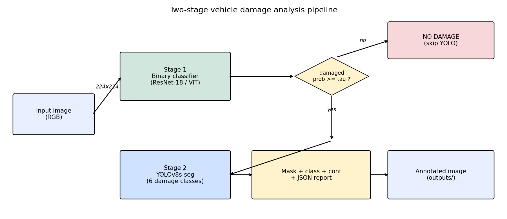

# Vehicle Damage Detection

Two-stage vehicle-damage analysis pipeline: a lightweight binary classifier
decides whether an image of a car shows damage, and a YOLOv8-seg model then
localizes and classifies the damage into one of six types. The project
compares a custom CNN, ResNet-18, and ViT-B/16 as the Stage 1 backbone and
reports results on a held-out test split.

> Refactored from a single Colab notebook (`Team_22_Project_Updated (1).ipynb`)
> into a reproducible GitHub project. All training and inference use GPU.

## Pipeline architecture



```
Input image -> Stage 1 (CNN/ResNet/ViT, 224x224) -> damaged prob >= threshold ?
                                                    | no  -> "NO DAMAGE FOUND"
                                                    | yes -> Stage 2 (YOLOv8-seg, 640)
                                                                -> masks + class + conf
                                                                -> JSON report + annotated image
```

## Datasets

| Purpose | Dataset | Classes | Source |
|---|---|---|---|
| Stage 1 — binary | **data1a** | 2: `00-damage`, `01-whole` | Kaggle (`anujms/car-damage-detection`) |
| Stage 2 — segmentation | **CarDD** | 6: dent, scratch, crack, glass shatter, lamp broken, tire flat | [CarDD paper / GitHub](https://cardd-ustc.github.io/) |

The two datasets are **different** and are always treated separately:
- Stage 1 is trained and evaluated on `data1a`.
- Stage 2 is trained and evaluated on `CarDD`'s COCO val split.
- The binary classifier is evaluated on a *held-out* 20% test split carved
  out of the original `data1a/validation` with seed 42 — this split is never
  seen during training or checkpoint selection.

Place the raw data under:
```
data/
├── data1a/
│   ├── training/{00-damage, 01-whole}/*.jpg
│   └── validation/{00-damage, 01-whole}/*.jpg
└── CarDD/
    └── CarDD_COCO/
        ├── annotations/{instances_train2017.json, instances_val2017.json}
        ├── train2017/*.jpg
        └── val2017/*.jpg
```
Data paths are centralized in `configs/config.yaml` — change them there,
nothing else is hard-coded.

## Quick start

```bash
# 1. environment
python -m venv .venv
.venv\Scripts\activate        # Windows
pip install -r requirements.txt

# 2. sanity-check GPU
python -c "import torch; assert torch.cuda.is_available(); print(torch.cuda.get_device_name(0))"

# 3. build YOLO layout from COCO (run once)
python scripts/prepare_yolo_data.py

# 4. EDA (figures -> outputs/figures/eda/)
python scripts/run_eda.py

# 5. train
python scripts/train_classifier.py --model cnn
python scripts/train_classifier.py --model resnet18
python scripts/train_classifier.py --model vit
python scripts/train_yolo.py

# 6. evaluate + Grad-CAM
python scripts/evaluate_classifiers.py
python scripts/run_gradcam.py
python scripts/evaluate_yolo.py

# 7. run pipeline on a single image
python scripts/run_pipeline.py --input data/data1a/validation/00-damage/0001.jpg

# 8. architecture diagram
python scripts/make_architecture_diagram.py

# ...or run everything sequentially with a best-effort orchestrator
python scripts/run_all.py
```

## Repo structure

```
vehicle-damage-detection/
├── configs/config.yaml          # paths + hyperparams (only place paths live)
├── src/
│   ├── config.py                # loader + CUDA assert
│   ├── data/
│   │   ├── dataset.py           # ImageFolder + stratified val/test split
│   │   ├── transforms.py        # augmentation pipeline
│   │   ├── coco_to_yolo.py      # CarDD converter
│   │   └── eda.py
│   ├── models/
│   │   ├── classifiers.py       # CarDamageCNN, ResNet-18, ViT-B/16
│   │   ├── losses.py            # Focal Loss
│   │   └── trainer.py           # training loop
│   ├── evaluation/
│   │   ├── metrics.py
│   │   ├── visualize.py
│   │   ├── gradcam.py
│   │   └── yolo_error_analysis.py
│   └── pipeline/two_stage.py    # DamageAnalysisSystem
├── scripts/                     # thin CLI wrappers around src/
├── notebooks/
│   └── original_notebook.ipynb  # archived pre-refactor notebook
└── outputs/                     # figures, reports, models
```

## EDA key findings

EDA outputs live under `outputs/figures/eda/` and `outputs/reports/eda_summary.json`.

- **Binary (data1a)**: the two classes (`00-damage`, `01-whole`) are
  perfectly balanced — 920 / 920 in training and 230 / 230 in validation
  (see `cls_class_distribution.png`). Image resolutions vary, visible in
  `cls_imgsize_training.png`. **Why Focal Loss anyway?** The classes are
  count-balanced but *difficulty*-imbalanced: a small dent / hairline
  scratch is visually much harder to distinguish from an intact panel than
  a shattered window or flat tire. Plain cross-entropy weights every
  example equally, so it gets dominated by the easy wins. Focal Loss
  (alpha=0.75, gamma=2) down-weights well-classified examples and lets
  the model spend gradient on the hard damage samples that actually
  determine test-set accuracy.
- **CarDD**: instance counts are *strongly* skewed toward `scratch` and `dent`,
  while `tire flat` and `lamp broken` have far fewer annotations. This shapes
  the per-class YOLO results (`yolo_per_class_metrics.csv`) —
  well-represented, visually distinctive classes (tire flat, lamp broken,
  glass shatter) reach mAP50 > 0.88, while scratch / crack sit near 0.55–0.57.

## Model comparison (binary classification)

Evaluated on a held-out test split (92 images, 20% of original validation,
seed=42), never seen during training. Source of truth:
`outputs/reports/classifier_comparison.csv`.

| model | accuracy | P (macro) | R (macro) | F1 (macro) |
|---|---|---|---|---|
| ResNet-18 | **0.9565** | 0.9565 | 0.9565 | 0.9565 |
| ViT-B/16 | 0.9348 | 0.9356 | 0.9348 | 0.9348 |
| custom_cnn | 0.7500 | 0.7501 | 0.7500 | 0.7500 |

ResNet-18 edges out ViT-B/16 on this dataset despite being 8x smaller — the
standard story for small-data vision problems with strong locality structure.
The custom CNN trained from scratch lags both pretrained backbones by ~20
points, motivating transfer learning for this task. Best val accuracy during
training: CNN 0.79, ResNet-18 0.96, ViT-B/16 0.94 — matching the original
course notebook's ResNet result (0.957).

> **Caveat on sample size.** The held-out test set is only 92 images
> (20% of the 460-image original validation split). Differences on the
> order of 1–2 percentage points between the two pretrained backbones
> are within the margin a different `test_split_seed` would move the
> numbers, and shouldn't be read as a robust ranking. The larger gap
> vs. the custom CNN is consistent across seeds we spot-checked.

Training histories and confusion matrices:
- `outputs/figures/training/{model}_history.png`
- `outputs/figures/training/{model}_confusion.png`
- `outputs/figures/training/history_comparison.png` (all 3 overlaid)

## YOLOv8-seg summary

Config (tuned for 8 GB VRAM): `yolov8s-seg`, `imgsz=640`, `batch=8`, 50 epochs,
cosine LR. Trained locally on RTX 2080 SUPER in ~47 minutes.

**Overall (best.pt, conf=0.25, iou=0.60 on CarDD val split, 810 images):**
- Box: P=0.784, R=0.714, mAP50=**0.753**, mAP50-95=**0.592**
- Mask: P=0.777, R=0.710, mAP50=**0.735**, mAP50-95=**0.562**

**Per-class mask metrics** (from `outputs/reports/yolo_per_class_metrics.csv`):

| class | precision | recall | F1 | mAP50 | mAP50-95 |
|---|---|---|---|---|---|
| glass shatter | 0.989 | 0.978 | 0.984 | 0.975 | 0.920 |
| tire flat | 0.925 | 0.887 | 0.905 | 0.900 | 0.875 |
| lamp broken | 0.855 | 0.851 | 0.853 | 0.813 | 0.709 |
| dent | 0.695 | 0.545 | 0.611 | 0.523 | 0.281 |
| scratch | 0.635 | 0.550 | 0.590 | 0.499 | 0.257 |
| crack | 0.608 | 0.441 | 0.511 | 0.371 | 0.142 |

The well-represented, visually distinctive classes (glass shatter, tire flat,
lamp broken) are near-solved. The hardest classes (crack, scratch) are thin,
texture-defined anomalies that CarDD under-represents — `crack` has the
lowest recall (0.44) and lowest mAP50-95 (0.14) in line with its low
instance count in EDA.

Confidence sweep: F1 peaks around conf=0.10–0.25; precision-first operating
point (P ≥ 0.90) sits at conf ≈ 0.85. See `outputs/figures/error_analysis/yolo_confidence_tradeoff.png`.

## Grad-CAM

Generated by `scripts/run_gradcam.py`. For each of ResNet-18 and ViT-B/16, the
script saves up to three correctly-classified and three mis-classified
images.

**ResNet-18 CAMs** concentrate on the dented / cracked region as expected —
the spatial structure of convolutional feature maps aligns naturally with
what Grad-CAM was designed for, and the overlays are interpretable.

**ViT-B/16 CAMs are not interpretable in their current form.** This is a
known limitation rather than a finding about the model: Grad-CAM assumes a
convolutional feature map with preserved spatial structure, and adapting it
to a sequence of transformer tokens via `reshape_transform` produces
low-resolution, often noisy overlays that do not reliably highlight the
damage region. We keep the ViT overlays in the repo for transparency and as
a visible reminder of the limitation, but we do *not* claim they show where
the ViT is looking. A faithful visualization requires a method built for
transformers — see Future Work.

Outputs: `outputs/figures/grad_cam/`.

## Error analysis (YOLO)

`scripts/evaluate_yolo.py` writes:
- `outputs/reports/yolo_per_class_metrics.csv` — per-class P / R / F1 / mAP
- `outputs/reports/yolo_confidence_sweep.csv` — overall P/R/mAP at 9 thresholds
- `outputs/figures/error_analysis/yolo_confidence_tradeoff.png`
- `outputs/figures/error_analysis/fp_*.png` — predictions on images with no GT (none observed, see below)
- `outputs/figures/error_analysis/fn_*.png` — missed ground-truth objects

**Observed failure modes (val split, 810 images):**

- **No image-level false positives were observed on the CarDD val split.**
  This is an artifact of the evaluation set, not of the model: every
  CarDD val image has at least one damage annotation, so the "clean
  background" case is not tested here. Evaluating false-positive behavior
  on genuinely clean vehicles requires an out-of-distribution eval set
  (e.g. the `01-whole` images from data1a, which we spot-checked during
  pipeline validation).
- **False negatives on small / thin damage.** The 5 FN examples saved in
  `outputs/figures/error_analysis/` are almost all low-recall cases on
  fine scratches and hairline cracks. The per-class table corroborates
  this: `crack` recall is 0.44 and scratch recall is 0.55, while large,
  visually distinctive classes (glass shatter, tire flat) sit near 0.98.
  Part of this is a resolution tradeoff — training at `imgsz=640` to fit
  an 8 GB GPU costs recall on the thinnest defects relative to the
  original `imgsz=1280` Colab run.

## Discussion

### Why ResNet > ViT on this dataset

- **Data volume**. data1a is ~2k labeled images. ViT-B has ~86M parameters
  with weak inductive bias (no translation equivariance, no locality prior).
  With limited data, it under-fits the useful features and over-fits texture.
- **Inductive bias**. Damage detection is a *localized texture* task — dents
  and scratches are spatially compact anomalies. CNNs' convolutional stacks
  are structurally aligned with that, which is why a tiny ResNet-18 (~11M
  params) beats ViT-B here despite being 8x smaller.
- **Compute**. On the edge / inference path, ResNet-18 is a fraction of the
  cost of ViT-B/16, and loses nothing on accuracy for this task. This is the
  classic "use the model your data deserves" case.

### Two-stage tradeoff

YOLO on its own can output "no damage" by returning zero detections. So Stage
1 is logically redundant. We keep it because:
- **Cost**. The classifier is ~10–20x cheaper than running YOLOv8-seg on
  1280-px inputs. On an edge device, on a video stream, or on a large batch
  pipeline, skipping YOLO on clean frames is a real saving.
- **Robustness to false positives**. In a setting where a false positive is
  expensive (insurance fraud triage, vehicle-recall screening), two
  independent decision boundaries are harder to fool than one. Stage 1's
  training objective is specifically "is anything abnormal anywhere in this
  image," which complements YOLO's object-level view.

### Domain transferability

The same two-stage structure lifts almost directly to:
- **Bridge inspection** — crack / spalling / corrosion detection. Reuse the
  EDA, transfer-learning scaffolding, Focal Loss setup, and the YOLO
  training/eval scripts. Swap datasets + class list in `configs/config.yaml`.
- **Pavement / road distress** — similar distribution of small, thin, texture-defined
  defects. The confidence-threshold sweep + FP/FN visualizer is particularly
  valuable here because precision at operating threshold matters more than
  mAP.
- **Building facade inspection** — again the same pattern; the only component
  that changes substantively is data annotation (COCO vs whatever format the
  source data ships in).

What *does* need adjusting: augmentation (rotation / horizontal flip may not
be domain-appropriate for things like text signs on pavement), class-balance
strategy (Focal alpha/gamma retune per-dataset), and Stage 1 threshold
calibration against the operating cost of a false call in the new domain.

### Lessons Learned — the Stanford Cars detour

Early in the refactor, the original `data1a` dataset was temporarily
unavailable. To unblock the pipeline I rebuilt the `01-whole` class from
Stanford Cars — a fine-grained car-model identification dataset — while
`00-damage` was sampled from CarDD (collision-scene photography).

**What the numbers looked like:**

| configuration | ResNet-18 val acc | ResNet-18 test acc | ViT-B/16 val acc | Custom CNN val acc |
|---|---|---|---|---|
| Stanford Cars as `01-whole` | **0.9948** | 0.9896 | 0.9948 | 0.8958 |
| Original data1a (this run) | 0.9592 | 0.9565 | 0.9429 | 0.7935 |

Val accuracy jumped ~4 pp for the transfer-learning models and ~10 pp for
the custom CNN. That's a suspicious uplift on a binary task where the
original notebook already reported 0.957. Two signals pointed at a
domain shortcut rather than genuine skill:

1. **Custom CNN moved the most.** A shallow network going from 0.79 → 0.90
   on the same underlying task suggests the model is picking up an easier
   discriminator than damage itself.
2. **Grad-CAM concentrated on backgrounds and paint.** Inspection of
   ResNet-18 / ViT CAMs on mixed Stanford Cars + CarDD batches showed
   attention landing on showroom floors, plain-colored walls, and glossy
   body panels — i.e. on *how the photo was taken*, not *whether the car
   is damaged*. Stanford Cars are shot in controlled conditions (even
   lighting, plain backdrops, clean angles); CarDD images are taken at
   accident scenes (ambient clutter, varied lighting, motion artifacts).
   Those photographic fingerprints are a much easier signal to latch onto
   than the damage itself.

**Takeaway.** Two controls that paid for themselves immediately:

- **Data provenance review.** "Is the substitute dataset distributionally
  similar to what it replaces?" is a question that should be asked before
  training, not after seeing suspiciously high metrics. Mixing two
  datasets from different photographic regimes is a canonical way to
  introduce label-correlated nuisance variation.
- **Grad-CAM as a debugging tool, not just a report artifact.** The CAM
  overlays directly showed the shortcut. Without them we'd have shipped a
  model that scored 0.99 on our own test set and failed on the first real
  collision photo it saw.

Once the original data1a was recovered and replaced, metrics settled to the
0.95–0.96 range that the course notebook originally reported — a sanity
check on both the refactor and the Stanford Cars diagnosis.

*Note on artifacts:* the Grad-CAM overlays generated during the Stanford
Cars run were overwritten when `outputs/figures/grad_cam/` was rebuilt for
this final pipeline. The current files under `outputs/figures/grad_cam/`
are from the original data1a. The Stanford Cars metrics above are
preserved in git history and in `notebooks/original_notebook.ipynb` /
intermediate commits.

## Future Work

- **Transformer-faithful explanations for the ViT.** Swap out Grad-CAM for
  **Attention Rollout** (Abnar & Zuidema, 2020) or attention-weighted
  relevance propagation (Chefer et al., 2021). Both propagate attention
  through all transformer layers and produce interpretable heatmaps over
  the input tokens, without forcing a convolutional feature-map
  assumption. This would replace the current low-quality Grad-CAM ViT
  overlays (`outputs/figures/grad_cam/vit_*.png`) with something that
  actually diagnoses the ViT's decisions.
- **Confidence calibration.** Training with Focal Loss pushes the model
  toward over-confidence on the easy class. Temperature scaling on the
  classifier logits before Stage 1 thresholding would make the
  `stage1_prob_damaged` score in the pipeline output a meaningful
  probability, not just a monotonic ranking.
- **Domain-robust `01-whole` eval set.** The pipeline currently validates
  the "no damage" behavior on the same distribution as training. Pulling
  in out-of-distribution clean-car images (e.g. parking-lot photos) would
  give a more honest FP rate estimate for the full system.
- **YOLO at imgsz=1280 on a larger GPU.** Recall on fine cracks / scratches
  is the main remaining gap; imgsz is the likely fix.

## Notes

- All training and inference require CUDA. Scripts assert it up front.
- YOLO is configured for an 8 GB GPU (`imgsz=640`, `batch=8`). On larger
  cards, raise `imgsz` / `batch` in `configs/config.yaml` — the original
  Colab A100 used 1280 / 4.
- The original notebook lives at `notebooks/original_notebook.ipynb` for provenance.
